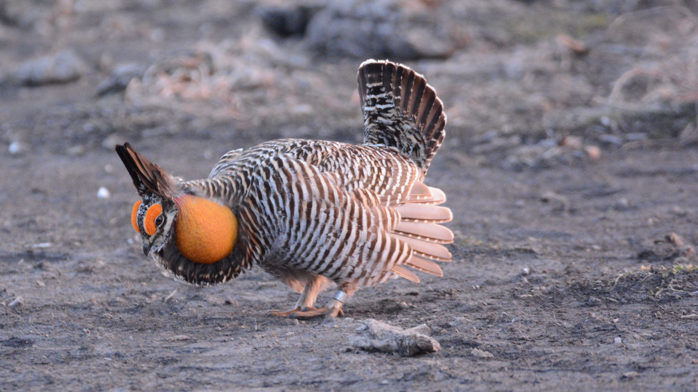

The main project I'm working on right now has to do with spatial statistics, specifically Markov random field models. It proposes a rather primitive model for a case when we collect two response variables at each location on a lattice. Most of the code and data I used in this paper can be found in [this github repo](https://github.com/stharms/bivariatemixedMRF), although it may not be too pretty.

[Here](https://github.com/stharms/bivariatemixedMRF/blob/master/nextdraft.pdf) is a link to a .pdf of the final draft (pending last minute edits) of the manuscript summarizing most of my research, which is going to be presented for the creative component for my Master's degree at ISU in early April 2019.

I used some data on prairie chickens and soil properties to illustrate the model. Here is a picture of a greater prairie chicken (presumably standing on some soil that has properties):

